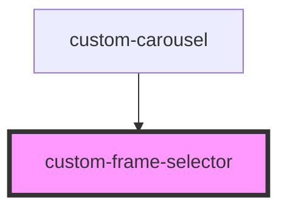

# custom-frame-selector

<!-- Auto Generated Below -->

## Properties

| Property                  | Attribute             | Description | Type     | Default     |
| ------------------------- | --------------------- | ----------- | -------- | ----------- |
| `currentFrame`            | `current-frame`       |             | `number` | `0`         |
| `frameCount` _(required)_ | `frame-count`         |             | `number` | `undefined` |
| `initialFrameIndex`       | `initial-frame-index` |             | `number` | `0`         |

## Events

| Event         | Description | Type                  |
| ------------- | ----------- | --------------------- |
| `frameChange` |             | `CustomEvent<number>` |

## Dependencies

### Used by

 - [custom-carousel](../custom-carousel)

### Graph

----------------------------------------------

*Built with [StencilJS](https://stenciljs.com/)*
